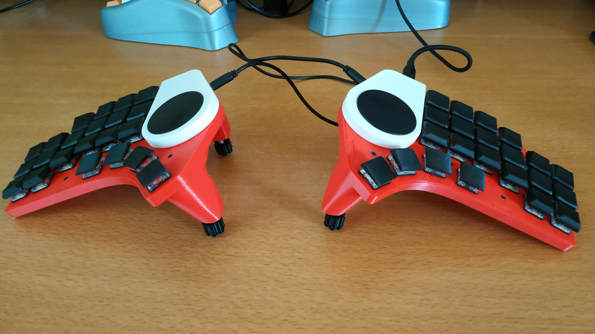
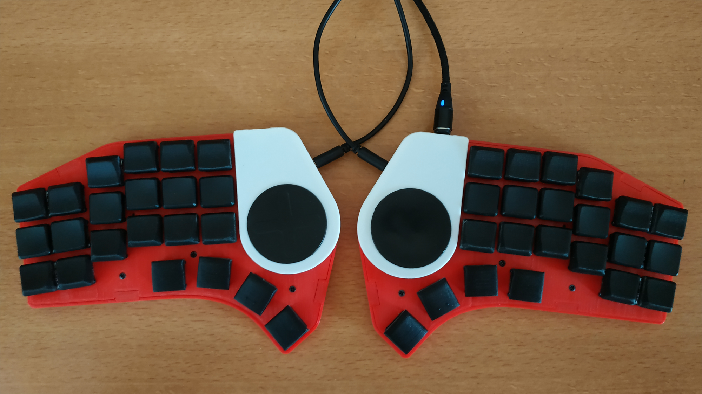
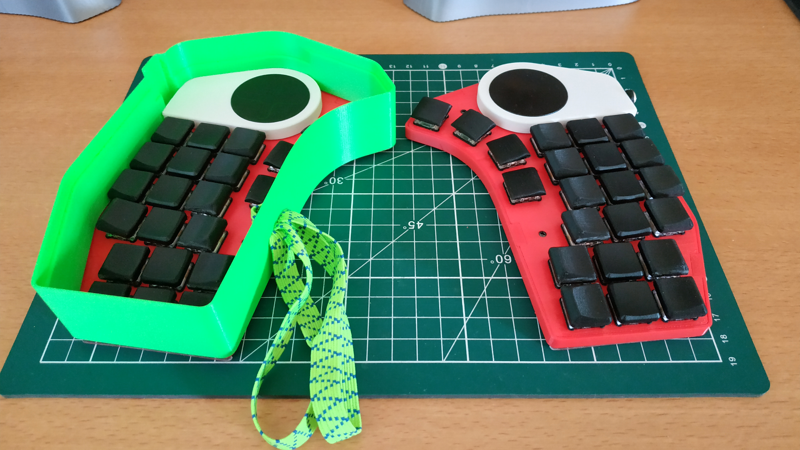
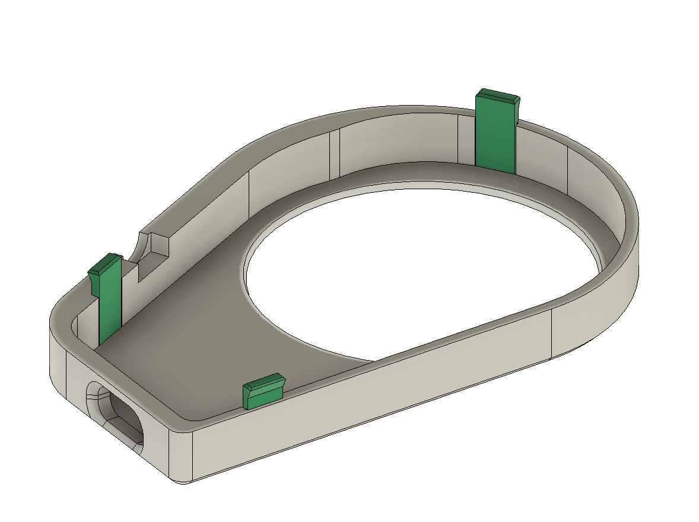
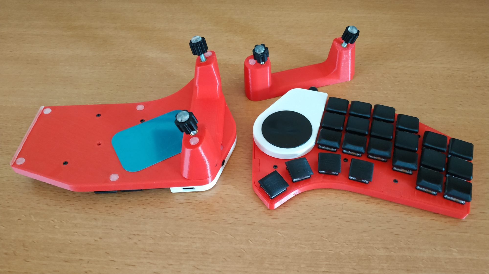
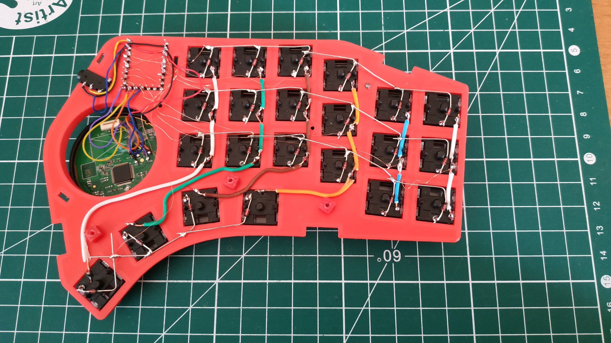
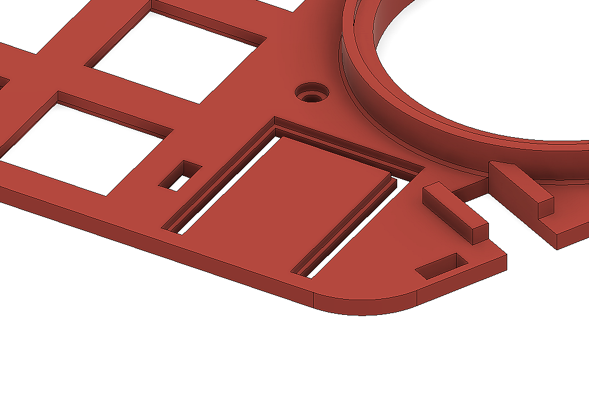

# Birdy44

A low-profile 3d printed and handwired split keyboard

## Supplies

-   2x Waveshare RP2040-Zero
-   Mill-Max round pin headers
-   2x 40mm Cirque Trackpads
-   2x TRRS connectors
-   44x Kailh Choc V1 switches
-   44x ln4148 diodes
-   8x round magnets 8x2mm
-   4x round magnets 8x3mm
-   4x M4 40mm bolts
-   4x M4 heat inserts
-   M2x3 self tapping screws

## Building notes

### Printing

All parts were printed in PLA, 0.2mm layer height.

I intended to use magnet to keep the halves in the transport case. The cases have cavities to insert 10x3x2 magnets.
It prove to be not powerful enough to keep the halves in place, hence I went for 10mm elastic tape
Either try using bigger magnets or don't bother with these.
The transport case doesn't include any magnet inserts so it would need to be reworked if you indeed want to use magnets.

To avoid breaking the tabs on the cover, I choosed to print them apart laying flat and glue them to the cover.

### Tenting

The cases and tenting legs have magnets inserts : 4x 8x2mm for each case and 2x 8x3mm for each tenting leg.
Add pause during printing to insert the magnets (at 2.60mm for the cases and 3.40mm for the legs).
A snug fit and a 0.2mm top chamfer avoid the magnets to be pulled off by the printing head.

Install the heat inserts in the holes, I advise using the bolts through the hole to ensure the alignment is correct.

There is a small recess on the legs as I added a metal plate to use with other tenting devices like Z Flex tripod.

### Wiring

I suggest looking at Joe Scotto's excellent handwiring guides on Youtube.

The RP2040 is socketed with Mill-Max round pin headers. I soldered cut diode legs to the MCU as pins.

The pin headers are glued on the plate, they should sit on the lip of the plate, may need some sanding.

The TRRS connectors are glued on the plate after soldering.

The trackpads are held in place by the covers, I did not glue them, allowing for orientation adjustment.

## License

This work is licensed under a <a rel="license" href="http://creativecommons.org/licenses/by-nc-sa/4.0/">Creative Commons Attribution-NonCommercial-ShareAlike 4.0 International License</a>
